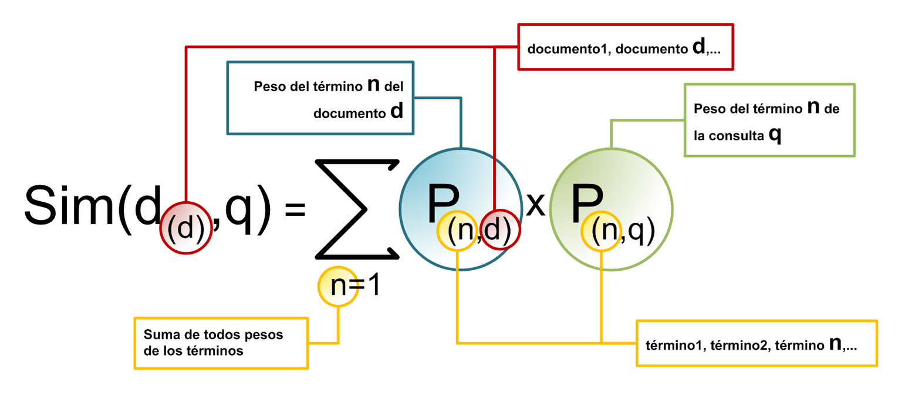
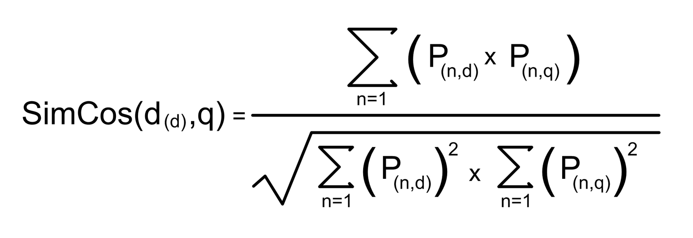
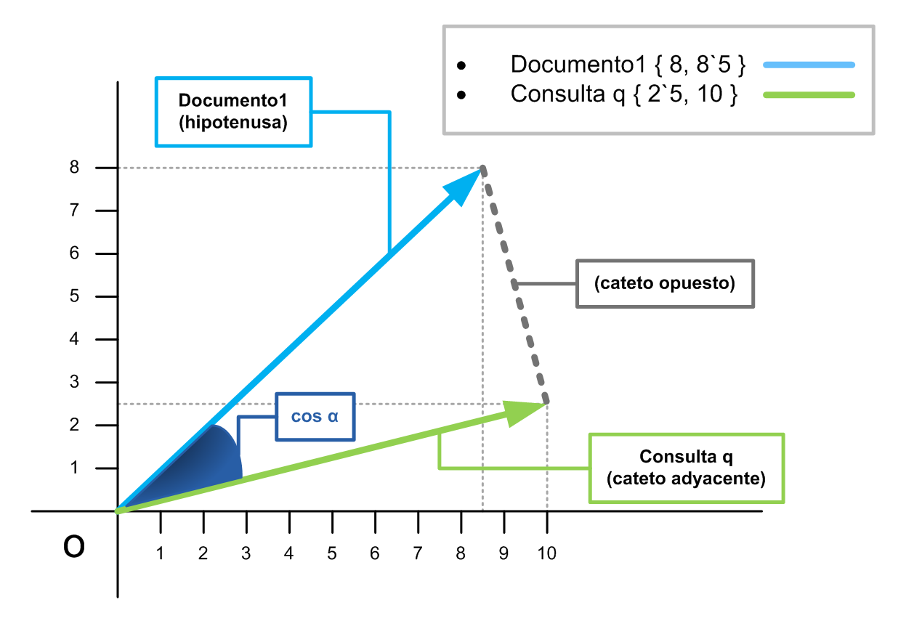
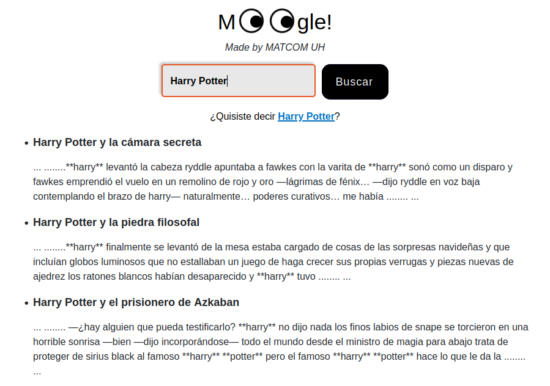
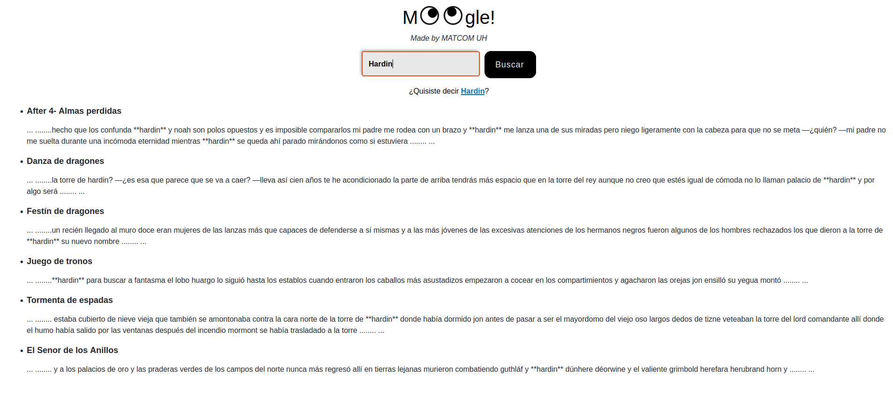
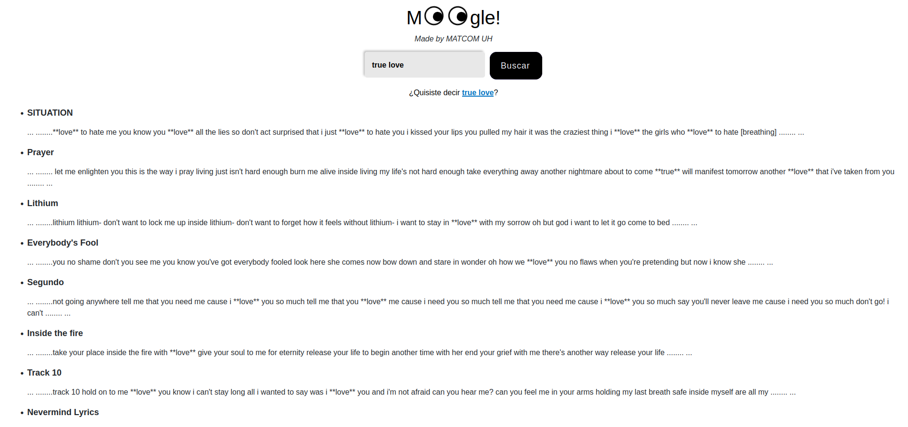

# Moogle!


> **Information Retrieval Project**
> Computer Science Faculty - University of Havana
> Academic Year 2023-2024

**Moogle!** is an information retrieval application designed for **intelligently searching text within a corpus of documents**, leveraging the **Vector Space Model** (VSM).

This is a web application developed with **.NET Core 7.0** using **C#**. The graphical interface utilizes the **Blazor** web framework.

The application is fundamentally divided into two components:

-   `MoogleServer`: The web server component that renders the graphical interface and delivers search results.
-   `MoogleEngine`: A class library containing the core logic for the search algorithm and information retrieval engine.

## Table of Contents

1. [Setup and Run](#setup-and-run)
2. [Key Search Features](#key-search-features)
3. [Workflow](#workflow)
4. [Basic Architecture: Vector Space Model](#basic-architecture-vector-space-model)
5. [Similarity Metric: Cosine Similarity](#similarity-metric-cosine-similarity)
6. [Core Engine Components](#core-engine-components)
7. [Examples](#examples)
8. [Author](#author)

---

## Setup and Run

To execute the project, you need a web browser installed and **.NET Core 7.0** or a compatible runtime environment available on your system.

**To run the application:**

1.  Navigate to the project's root folder in a **Linux** terminal or **WSL** (Windows Subsystem for Linux).
2.  Execute the following command:

```cs
make dev
````

Alternatively, the ultimate command (from the root directory) is:

```cs
dotnet watch run --project MoogleServer
```

**To perform a search:** Simply enter a phrase into the search box and click the **Search** button or press the **Enter** key.

-----

## Key Search Features

The search functionality is designed for intelligent retrieval, meaning the user is **not limited to documents containing the exact phrase**.

  - The user can search using an entire phrase, not just single words.
  - **Partial Matches:** If a document only contains a subset of the query terms, it will still be returned, but with a proportionally lower relevance score.
  - **Term Order and Proximity:** The order or proximity of the terms within the document generally does not matter.
  - **Term Count:** Documents with more query terms tend to have a higher relevance score (unless those terms are less relevant overall).
  - **Stop Word Filtering:** Extremely common words (e.g., prepositions, conjunctions) are automatically ignored. This process is not based on a hardcoded list but is **computed dynamically** from the document corpus to identify and discard terms with high document frequency.

-----

## Workflow

The system operates in two main phases: **Indexing** and **Query Processing**.

### Indexing (Server Startup)

Upon server initialization, an instance of a `Searcher` object is created. This object performs the following steps:

1.  **Document Loading:** Loads the documents and extracts relevant metadata (name, path, term frequency).
2.  **Corpus Dictionary:** Creates a dictionary of all unique terms across the entire document corpus.
3.  **TF-IDF Calculation:** Computes the **Inverse Document Frequency (IDF)** for every term in the corpus. This metric is then used to normalize the **Term Frequency (TF)** in each document, yielding the **TF-IDF** weights. These weights define the relevance of each term within the document and the corpus and are stored for subsequent searches.

### Query Processing (User Search)

When a user submits a query via the interface:

1.  **Query Term Processing:** The query is processed similarly to the documents (term separation, tokenization, and TF-IDF calculation) to create a **query vector**.
2.  **Scoring (Similarity):** The search space is ranked by calculating the **relevance score** (*score*) of each document against the query. This is achieved using the **Cosine Similarity** between the document vectors and the query vector.
3.  **Result Retrieval:** The list of documents is sorted by their score (highest to lowest) and returned to the user.
4.  **No Results:** If none of the query terms are found in the corpus, no results are returned.

-----

## Basic Architecture: Vector Space Model

This project implements the **Vector Space Model (VSM)** for information retrieval. VSM is based on multidimensional linear algebra, modeling both documents ($D_i$) and the query ($Q$) as vectors in a space where each dimension corresponds to a unique term in the corpus.

### Term Weighting: TF-IDF

The components of these vectors represent the degree of relevance of a term, measured using **TF-IDF** weights:

  - **Term Frequency (TF):** The number of times a term appears in a document divided by the total number of words in that document.
  - **Inverse Document Frequency (IDF):** Calculated as $\log_{10}(N/D)$, where $N$ is the total number of documents in the corpus and $D$ is the number of documents in which the term appears. If a term does not appear in any document, its IDF is 0.

The final relevance weight for a term in a document or query is the product of these two values ($\text{TF} \times \text{IDF}$).

-----

## Similarity Metric: Cosine Similarity

Once the document and query vectors are constructed, the degree of similarity between them must be determined. While the dot product is the simplest method, the **Cosine Similarity** is the most widely used index, as it normalizes the vector length, avoiding distortions caused by differences in document size.

The similarity index between a query $Q$ and a document $D_i$ is calculated as the cosine of the angle $\theta$ between their vectors:

$\text{Similarity}(Q, D_i) = \cos(\theta) = \frac{Q \cdot D_i}{\|Q\| \cdot \|D_i\|}$.

Documents with the highest degree of similarity will have the highest **score**. These high-scoring documents are the ones returned by the search engine.






> **Further Reading:** For more details on this model, refer to the Wikipedia article (available in Spanish and English): [Modelo vectorial generalizado](https://es.wikipedia.org/wiki/Modelo_vectorial_generalizado)

-----

## Core Engine Components

The search algorithm is implemented using several core classes, each abstracting a fundamental component of the engine:

- `DataFile`: Represents a single document, storing its path, name, and term frequency data.
- `DataFolder`: Represents a collection or container of documents (`DataFiles`).
- `Query`: Encapsulates and processes the user's search query, turning it into a query vector.
- `Tools`: A utility class containing static methods for text processing (tokenization, stemming, etc.).
- `Engine`: The base class responsible for managing `DataFile`, `DataFolder`, and `Query` objects to produce structured results.
- `SearchItem`: Represents a potential document match, containing the document reference and its calculated relevance score.
- `SearchResult`: The object returned to the user, containing the ordered list of `SearchItem` objects and any related metadata.
- `Moogle`: Contains the primary entry point method, `Moogle.Query()`, which orchestrates the search and returns a `SearchResult` object.

-----

## Examples




-----

## Author
* Rlianny - revelianny10@gmail.com


